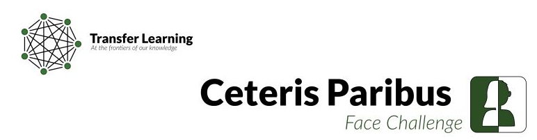

# Face editing with Style GAN 2 and facial segmentation (Ceteris Paribus Face Challenge Intercentrales 2022)

Repository of Inter-Centrales 2022 AI competition: Ceteris Paribus Face Challenge: [site of the competition](https://transfer-learning.org/competition.html).

This work is under the MIT license.



This repository uses third-party works:

- [anycost-gan](https://github.com/mit-han-lab/anycost-gan) (MIT license)
- [face-parsing.PyTorch](https://github.com/zllrunning/face-parsing.PyTorch) (MIT license)
- [DensePredictionTransformer / DPT](https://github.com/isl-org/DPT) (MIT license)

Licenses are provided in `third_party_licenses`.

## To-Do list

- [x] Project images in latent space
- [x] Modify bounds of the direction
- [x] Find translations in latent space
- [x] Saving pipeline for direction
- [x] Solve bald issue
- [x] Detect and improve bad translations
- [x] Solve specific issues (manually or with other methods)
- [x] Focused change by semantic segmentation
- [x] Resolve some artefacts and background problems with depth estimation
- [x] Refactor the code to make it more convenient
- [ ] Add a convenient config system - IN PROGRESS 🚧
- [ ] Improve realism with GFP GAN - IN PROGRESS 🚧
- [ ] Look for other repo to solve skin and age
- [ ] Test GAN retraining and extract direction features

## Quick Start

**Note**: you need a Nvidia GPU to run the processing. Only editor API with pre-computed latent vectors is avalaible with CPU.

### Installation

Clone this repository and pull the models required from postprocessing via LFS:

```script
git clone git@github.com:valentingol/gan-face-editing.git
cd gan-face-editing
git lfs pull
```

Then, create a new virtual environment and install all the required packages:

```bash
pip install -e .
pip install -r requirements.txt
```

The original dataset of the competition is available here: [drive dataset](https://drive.google.com/drive/folders/1-R1863MV8CuCjmycsLy05Uc6bdkWfuOP?usp=sharing)

Unzip the content in a folde called `data/face_challenge`.

### Compute latent space of images

Once the data are downloaded, you must compute the projected latent vectors of the images. It can take some hours to compute as the script optimize the latent vector through multiple gradient descent steps but you can significantly reduce the time by reducing the number of iterations in configurations (0 iteration mean that you get the latent vector computed by the pretrained encoder and the time is reduce to about 1 minute).

```bash
python apps/project_images.py
```

### Editor API

Optionally, can run following the script to launch the image editing API.

```bash
# if you have a Nvidia GPU:
FORCE_NATIVE=1 python editor_API.py
# otherwise:
python apps/editor.py
```

In this API you can visualize and edit the reconstructed images using attribute cursors to build the changes you want. Default translations are already available in this repository but you can edit your own with the button "Save trans". The translations will be saved at `projection/run1/translations_vect`. You can also save the edited images with the button "Save img". The images will be saved in `projection/run1/images_manual_edited`. Note that to allow an automatic translation in the competition dataset, the name of the translation should follow specific rules that are describe in "Save your own translations" section.

### Translation and postprocessing pipeline

You can now run the full pipeline to apply automatic translation on all the input images and apply three steps of postprocessing (in this order):

- domain mixup (using constant area of interest)
- segmentation mixup (using ResNet)
- depth segmentation mixup (using ViT)

```bash
python apps/run_pipeline.py
```

All steps of the pipeline can be run individually and the results after all steps are saved in `res/run1`.

The final images are saved under `res/run1/images_post_depth_segmentation`.

## Postprocessing

### Domain Mixup

To keep only the modification near the area where we expect them (called 'domain') for a specific change, a mixup is applied. The idea is to draw an area in a 512x512 white image that correspond to the area we expect add the changes, for each caracterisitc. The images are saved in `postprocess/domain_mixup/images/` (black and white images and black pixels correspond to the domain).

```bash
python pipeline/domain_mixup.py
```

By default, the resulting images are in `res/run1/images_post_domain_mixup/` and the distances from all pixels to the domains are saved in `postprocess/domain_mixup/distances`.

### Segmentation

To go further in the last idea, we apply a semantic segmentation on the original image and the edited images in order to find for each image and for each transformation the area where we expect to find the change. First you need to get the segmentaion model by Git LFS (see [Git LFS](https://git-lfs.github.com/) for details):

```bash
git lfs pull
```

Note than you can use an other model you want as long as it is compatible with the models used by [face-parsing.PyTorch](https://github.com/zllrunning/face-parsing.PyTorch). You should modify the configurations to set the path of your new model.

Then you can run the following script to merge the previously edited images with the original ones by semantic segmentation:

```bash
python pipeline/segment.py
```

By default, the resulting images are in `res/run1/images_post_segmentation/`

### Depth estimation

In order to improve the segmentation, we perform depth estimation to correct artefacts of the backgrounds for the images coming from the segmentation. First, you need get the model for depth estimation with LFS. Otherwise you can download it here: [download](https://drive.google.com/file/d/1vnuhoMc6caF-buQQ4hK0CeiMk9SjwB-G/view) and put it on `postprocess/depth_segmentation/model/`.
The idea is to make a depth estimation with a transformer model (see [DPT](https://github.com/isl-org/DPT)). Then we build the foreground mask with a K-means algorithm. This allows to extract a relevant foreground from the segmented image and to paste it on the background of the original image.

Then you can run the following script to merge the previously edited images with the original ones by depth estimation:

```bash
python pipeline/depth_segmentation.py
```

By default, the resulting images are in `res/run1/images_post_depth_segmentation/`

## To go further

### Save your own translations

To save the translations (= latent direction) you want in the `projection/run1` folder, you can click on the "Save trans" button. **The name of the translation should follow the name convention:**

- for 'cursor' transformation (min - max): `{carac}_{'min' or 'max'}`. Example `Be_min` means cursor transformation to minimal bags under the eyes (Be_min).

- for default transformation (transformation that doesn't depend on the current value of the caracteristic): `{carac}_{new_value}`. Example: `Hc_0` means default transformation to black hair color (Hc_0)

- for specific transformation (transformation that depends on the current value of the caracteristic) that will overwrite default transformation: `{carac}_{new_value}_fr_{old_value}`. Example `A_0_fr_1` means specific transformation from intermediate age (A_1) to young age (A_0), 'fr' means 'from'.

All required transformations must be treated for all input caracterisics to make a valid submission. Note that this repository contains enough default translations to make a submission.

Now, given an input image, the transformations to create caracterisitcs that are not in the initial image can automatically be processed with the function `pipeline/utils/translation/get_translations.py`.

If the script raise an error indicating that the number of tranlations is not the same as expected, you should verify that your translations handle all caracteristics from all ones and have a valid name.

### Extract other attribute directions

:construction:

### Retrain the GAN

:construction:
